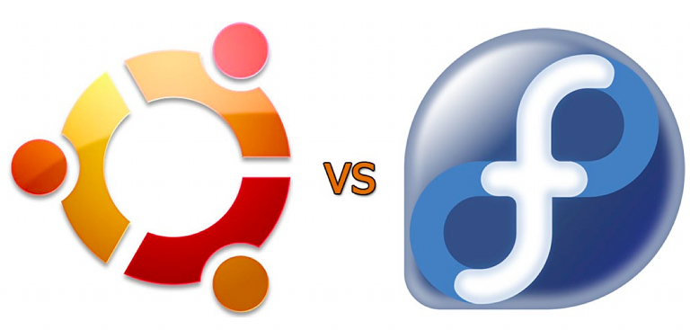

!SLIDE
# Macdrift #

# Klientdrift av en ny platform #

# IT-Forum 2013 #

.notes Presentasjonens forside

!SLIDE bullets incremental
* Hvor vi var for et år siden

* 

!SLIDE bullets

* 

!SLIDE bullets incremental

# Presentasjon av presentasjonen #
* Jeg vil gå igjennom hvor vi er nå, og litt om hva vi tenker videre fremover.
* Det vil også bli fortalt litt om de verktøyene som vi bruker til installasjon og konfigurasjon.
* Fokuset har vært på bruk av opensource verktøy til tross for at selve plattformen (Mac) er lukket. 

!SLIDE bullets incremental

* Utgangspunkt har vært det ikke-driftede mac-brukere ved UiB har idag m.t.p å selv kunne konfiguere enheten (self-service).
* En mobil platform som byr på nye utfordringer.
* Fokuset har vært på å innføre sentralisert drift av en ny plattform.

!SLIDE bullets incremental

# Introduksjon #

!SLIDE bullets incremental

## Historikk ##

!SLIDE bullets incremental

### Hvor lenge har man planlagt dette?
* En god stund
* Første referat jeg finner i farten er fra 2008

### Når ble giret skiftet?
* Høsten 2012

### Når kom man i test?
* 24.1.2013
* Nå ble alle nye macer tilbudt klientoppsett

!SLIDE bullets incremental

### Når kommer man i mål?
* Rundt 15. aug er planen å avvikle support på ikke-driftet mac
* Utvikling av drift på platformen vil være en kontinuerlig prosess
* Vi er i produksjon nå

!SLIDE bullets incremental

## Fordeler ##

!SLIDE bullets incremental

### For brukere
* Brukerstøtte
* Automatiske oppdateringer av programvare og operativsystem
* Ferdig konfigurert mot de viktigste UIB tjenestene

!SLIDE bullets incremental

### For brukerstøtten
* Økt fokus på mac ved ITA gir økt kunnskap om mac for alle involverte
* Å lære nye ting er gøy
* Automatisering av prosesser som man tidligere har gjort manuelt
* Gir mer tid til support og brukerkontakt
* Annet

!SLIDE bullets incremental

### For infrastruktur
* Installasjon, konfigurasjon og dokumentasjon av enheter
* Mer arbeid

!SLIDE bullets incremental

## Ulemper ##

!SLIDE bullets incremental

### For brukere
* Maskinen kommer noe senere til brukeren
* Annet?

### For brukerstøtten
* ?

### For infrastruktur
* ?

!SLIDE bullets incremental

# Hva er klientdrift? #
* 
* 
* 

!SLIDE bullets incremental

* Installasjonstjenester
* Konfigurasjon av enheter
* Overvåking / Monitorering
* Videreutvikling av klientdrift
* Opplæring og dokumentasjon

!SLIDE bullets incremental

## Imaging ved hjelp av Deploystudio

!SLIDE bullets

* To Deploystudioservere, 1 i NG og 1 i AG

!SLIDE bullets
* Et image for testing og et for produksjon

!SLIDE bullets
* DHCP netbooter mot deploystudioservere

!SLIDE bullets incremental

* Vi får baseimager fra UiO, sparer oss mye arbeid

!SLIDE bullets
* Deploystudio er workflow basert

!SLIDE bullets
* Installerer Munki for programvareadministrasjon

!SLIDE bullets
* Installerer Puppet for konfigurasjonsmanagement

!SLIDE bullets
* Binder mot AD

!SLIDE bullets
* Installerer root / admin bruker,
 

!SLIDE bullets
* Ferdig
 

!SLIDE bullets incremental

* Denne delen er altså lagt opp til å være brukervennlig, next-next-finish
* På sikt kan vi i teorien åpne for at brukerene installerer klientdrift på maskinene selv
* Problemer med DHCP og Netboot må løses først

!SLIDE bullets incremental

!SLIDE bullets incremental

## Konfigurasjon av enheter

!SLIDE bullets incremental

* Puppet og The Foreman sørger for at konfigurasjon blir installert

!SLIDE bullets
* The Foreman lar oss konfigurere noden

!SLIDE bullets
* The Foreman gir oss mulighet til å klassifisere noder

!SLIDE bullets incremental

* Når dette er gjort vil Munki vite hvilken programmer som skal installeres
* Konfigurasjon kan avhenge av institutt
* Bruker samme infrastruktur som Linux klienter og servere

!SLIDE bullets incremental

Eksempel på konfigurasjon er

* Eduroam og VPN innstillinger for bærbare enheter
* Brannmur på
* Pullprint skrivere
* +++

!SLIDE bullets incremental

Eksempel på programvare er

* MS Office / Firefox
* Adobe Flash / Adobe Air / Java
* Skriverdrivere
* +++

!SLIDE bullets
* Munki gir mulighet for self-service på programvare

!SLIDE bullets incremental

* Det er et mål i seg selv å ikke låse ned enheten
* Vi ønsker ikke at brukeren skal føle seg begrenset av klientdrift oppsettet
* Vi ønsker at konfigurasjon skal kunne deles
* Konfigurasjon kan lastes ned, og installeres som vanlige pakker for ikke-driftet utsyr
* Mail / VPN / Eduroam / Print konfigurasjon

!SLIDE bullets incremental

## Monitorering

!SLIDE bullets incremental

* Hvem har fått konfigurasjonsoppdateringer
* Er det lenge siden enhetene har vært på UiB nett

!SLIDE bullets
* The Foreman gis oss oversikten

!SLIDE bullets incremental 

* Vi får et oversiktsbilde over tingenes tilstand
* På sikt implementering av logging mot felles loggmottak (Logstash)
* Dette vil gi mulighet for bedre monitorering / status

!SLIDE bullets incremental

## Videreutvikling av klientdrift

!SLIDE bullets incremental

* OS X er et os som ikke er tilrettelagt for stordrift
* OS X har hyppige releaser, 1 gang i året
* Historien har vist at Apple er slapphendt med bakoverkompatibilitet
* OS X kan ikke nedgraderes

!SLIDE bullets incremental

* Nettverkshome VS Lokal disk

!SLIDE bullets incremental

* Mobile enheter er ofte på vift
* Vi kan ikke gå utifra at enhetene har sikker, rask og stabil tilkobling til enhver tid
* Finnes få produkter som er gode nok til å synkronisere automagisk på en trygg og stabil måte
* Lokal disk + tilrettelegging for manuell backup / syncing kan være en gyllen middelvei

!SLIDE bullets incremental

* Kryptert disk

!SLIDE bullets incremental

* Mobile enheter er ofte på vift
* Mobile enheter bør ha mulighet til å kryptert disk.
* Vi kan ikke kryptere uten mulighet for de-kryptering.

!SLIDE bullets incremental

## Opplæring og dokumentasjon

!SLIDE bullets incremental

* Ny platform krever ny kunnskap
* for brukerene,
* og for brukerstøtten
* Vi må ha en plan

!SLIDE bullets incremental

* Vi har samlet mesteparten av kunnskap i BRITA - Spesialistgruppen
* Det jobbes fortløpende med dokumentasjon på IT-Hjelp
* Det jobbes med forbedret søk i dokumentasjon på IT-Hjelp
* Intern opplæring er en viktig strategi for å øke kunnskapen på generalistnivå

!SLIDE bullets incremental

# Applaus

!SLIDE bullets incremental
